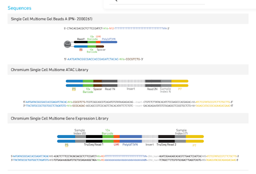

# 📦 blwgsR

## BootLeg Whole Genome Sequencing R package #TODO change this name maybe, something that incorprates ATAC and RNAseq, pacbio, and 10X
*an R package for parsing and combining pacbio long read sequencing with 10X multiomic data*

*R*
---

### 📦 R Installation

```R
devtools::install_github("ratoncito/blwgsR", force = TRUE)
library(blwgsR)

#parse the read into inserts barcodes sampleIDs 
read_info <- parse_reads(blwgsR::Fitzwalter2025, out.file = "test.csv")

#count CAG repeats and demultiplex the reads into cells 
cell_info <- demultiplex_reads(reads = read_info, out.file = "None")
```
#construct diagram 


#  parse reads function

input Path to the input file

out.file the location of the output file, where you want your results to be saved #TODO do we want this or should we just return the table

plot boolean of if you want plots to be created along the way to visualize the process

P5element TODO is this still necessary? #TODO remove

Spacer spacer element from 10X (see construct diagram)

Read1N element from 10X (see construct diagram)

Read2N element from 10X (see construct diagram)

P7Element element from 10X (see construct diagram)

HTTexon1_p1 TODO change this name to something more general; desired sequence match start sequence

HTTexon1_p2 TODO change this name to something more general; desired sequence match start sequence

SampleIndexes optional used to subset and filter the reads based on if you know what the sample indexes you are expecting

P5element.max.mm the max allowed mismatch for the P5 element TODO still necessary? this should be removed prior to running #TODO remove

Spacer.max.mm the max allowed mismatch for the P5 element TODO still necessary?

Read1N.max.mm the max allowed mismatch for the read1n element

Read2N.max.mm the max allowed mismatch for the read2n element

P7Element.max.mm the max allowed mismatch for the TODO still necessary?

HTTexon1_p1.max.mm the max allowed mismatch for the first part of the desired sequence matched gene #TODO make this not names HTT

barcode.length how long the 10X barcodes are expected to be

barcode.max.mm the max mismatch allowed for barcode from the whitelist to be considered a valid barcode

sampleid.length how long the 10 sample barcode is expected to be

sampleid.max.mm the max mismatch allowed for barcode from the SampleIndexes to be considered a valid sampleID barcode

file.format if the file is in fastq or not, fasta?

